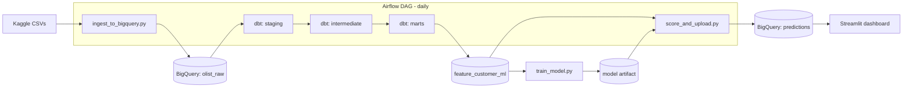

# Customer Repeat-Purchase Prediction Pipeline

An end-to-end data engineering + ML project: raw e-commerce data is ingested into
BigQuery, modeled with dbt, turned into ML features, scored with a trained
classifier, and served through a dashboard — orchestrated end to end with Airflow.

**Business question:** based on a customer's first order, how likely are they to
buy again within 90 days?

## Architecture



## Stack
- **Warehouse:** BigQuery (free sandbox tier is enough)
- **Transformation:** dbt-core — staging → intermediate → marts, tested and documented
- **ML:** scikit-learn / XGBoost
- **Orchestration:** Apache Airflow (local, via Docker)
- **CI:** GitHub Actions — runs `dbt build && dbt test` on every PR
- **Dashboard:** Streamlit

## Repo structure
```
.
├── data/                  # raw CSVs go here (gitignored) — see data/README.md
├── scripts/               # ingestion, training, scoring
├── dbt_project/           # staging / intermediate / marts models + tests
├── airflow/dags/          # orchestration DAG
├── dashboard/             # Streamlit app
└── .github/workflows/     # CI
```

## Setup

### 1. GCP + BigQuery
- Create a free GCP project and enable the BigQuery API.
- Create a service account with **BigQuery Data Editor** + **BigQuery Job User** roles, and download its JSON key.

### 2. Python environment
```bash
python -m venv .venv && source .venv/bin/activate
pip install -r requirements.txt
cp .env.example .env   # fill in your GCP project ID + key path
```

### 3. Get the data
See `data/README.md` for Kaggle download instructions.

### 4. Ingest raw data into BigQuery
```bash
python scripts/ingest_to_bigquery.py --data-dir data/raw
```

### 5. Run dbt (staging → intermediate → marts)
```bash
cd dbt_project
dbt deps
dbt build            # runs models + tests
dbt docs generate && dbt docs serve   # optional: view the lineage graph
```
Copy `dbt_project/profiles_example.yml` into `~/.dbt/profiles.yml` (or adapt it)
before running dbt.

### 6. Train the model
```bash
python scripts/train_model.py
```

### 7. Score customers and push predictions back to BigQuery
```bash
python scripts/score_and_upload.py
```

### 8. View the dashboard
```bash
streamlit run dashboard/streamlit_app.py
```

### 9. (Optional) Orchestrate the daily pipeline with Airflow
Use Airflow's official quick-start compose file rather than a hand-rolled one:
```bash
curl -LfO 'https://airflow.apache.org/docs/apache-airflow/stable/docker-compose.yaml'
```
Mount this repo's `airflow/dags/`, `dbt_project/`, `scripts/`, and `data/` folders
as volumes, set the same env vars from `.env` on the containers, then
`docker compose up`. Drop `churn_pipeline_dag.py` into the `dags/` folder and
trigger it from the Airflow UI.

A `Makefile` is included with shortcuts (`make ingest`, `make dbt-build`,
`make train`, `make score`, `make dashboard`, `make pipeline`).

## Design notes (worth mentioning in interviews)

- **Leakage control:** ML features are built only from a customer's *first*
  order (order value, delivery delay, review score, product category) — nothing
  from later orders leaks into the label. Deliberate modeling choice, not an
  oversight, and it's the kind of thing worth walking an interviewer through.
- **Training is decoupled from the daily DAG.** Scoring runs daily; retraining
  (`train_model.py`) is a separate, periodic step — mirrors how this is actually
  handled in production ML systems, where retraining cadence and serving cadence
  are different concerns.
- **dbt tests act as a data contract.** `not_null` / `unique` / `relationships`
  tests run in CI on every PR, so broken source data fails fast instead of
  silently corrupting the feature table downstream.

## Possible extensions
- Add Great Expectations or Elementary for richer data-quality monitoring.
- Add a feature-drift check (e.g., Evidently) comparing distributions over time.
- Swap the batch `score_and_upload.py` step for a lightweight FastAPI prediction endpoint.
- Move ingestion from full truncate-and-load to incremental/CDC.

## Dataset
[Olist Brazilian E-Commerce Public Dataset](https://www.kaggle.com/datasets/olistbr/brazilian-ecommerce)
— ~100k orders from 2016–2018, released publicly by Olist via Kaggle.
